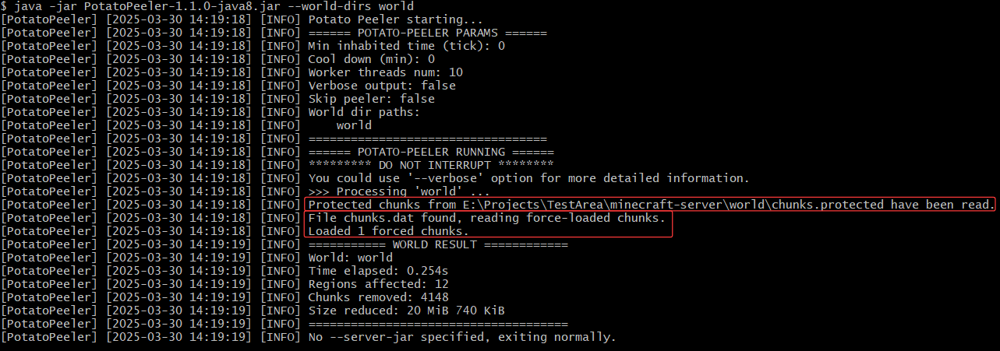

# PotatoPeeler

  

Lang: English | [简体中文](./README.zh_CN.md)

A simple tool to remove **unused chunks** from Minecraft worlds(**Java Edition**), freeing disk space.   

* Maybe a Java implementation of [Thanos](https://github.com/aternosorg/thanos).   

* Currently only supports the [Anvil](https://minecraft.wiki/w/Anvil_file_format) file format (since Minecraft JE 1.2.1).  

* In some cases, disk space occupied by the worlds can be reduced **by over 50%**.  

* Supports configuring **protected chunks** for each world using chunk coordinates and chunk coordinate ranges (wildcard `*` supported), preventing certain chunks from being removed.  

## 1. How It Works 

Chunks are stored within the [Anvil](https://minecraft.wiki/w/Anvil_file_format) file, and Minecraft Java Edition stores a field `InhabitedTime` for each chunk, which records the cumulative time **ticks** that players have spent within that chunk.

This tool finds out chunks where players have barely stayed by examining the `InhabitedTime` value, and then removes them. It can be used on both local game worlds and server worlds.

> The `InhabitedTime` of a chunk increases as long as a player is within the "mob spawn distance"<sup>[Doc](https://minecraft.wiki/w/Spawn#Spawn_cycle)</sup> of that chunk. Therefore, the `InhabitedTime` of chunks around the player's current chunk often increases as well.  

## 2. Important Notes Before Use

1. If you are using a Paper server or a server based on Paper (such as Purpur), **DO NOT** set the `fixed-chunk-inhabited-time`<sup>[Doc](https://docs.papermc.io/paper/reference/world-configuration#chunks_fixed_chunk_inhabited_time)</sup> key in the Paper World Configuration file to a value $\ge 0$, as this will fix the `InhabitedTime` of the chunks, thereby affecting the functionality of the tool.

2. If your world is created or edited by **mods / external softwares** rather than manual construction by players, the `InhabitedTime` values of the chunks may be unpredictable, and it's not recommended to use this tool in such cases.

   > Of course, you can configure [protected chunks](#5-protected-chunks) to prevent certain chunks from being removed.  

3. This tool can perform **in-place operations** on the region Anvil files. Before writing to each file in place, a backup file will be created. If an error occurs during writing, it will automatically restore the file. It is still advisable to occasionally make manual backups.  

## 3. Installation

1. You should have already installed the corresponding version of JRE (Java Runtime Environment). For details, refer to [this document](https://minecraft.wiki/w/Server/Requirements#Server_requirements).
2. Download the `PotatoPeeler*.jar` from [Releases](https://github.com/Bottle-M/PotatoPeeler/releases/latest) according to your Java version, and place it in a suitable location (such as the root directory of your Minecraft Server).  

## 4. Usage

You can run this tool from the command line:

```bash
java [jvmOptions...] -jar PotatoPeeler*.jar 
    [--world-dirs <worldPath1>,<worldPath2>,...]
    [--output-dirs <outputWorldPath1>,<outputWorldPath2>,...]
    [--server-jar <serverJarPath>]
    [--min-inhabited <ticks>]
    [--help]
    [--cool-down <minutes>]
    [--threads-num <number>]
    [--max-log-size <size>]
    [--retain-log-files <number>]
    [--verbose]
    [--dry-run]
    [--skip-peeler]
    [additionalOptions...]
```

| Flag | Description |
|---|---|
| `--help` | Displays help information |
| `--verbose` | Outputs detailed information to the log |
| `--dry-run` | Performs a dry run, no actual write operations will be executed, recommended to combine with the `--verbose` flag |
| `--skip-peeler` | Skips chunk processing, no chunks will be removed. If the `--server-jar` parameter is specified, it will directly launch the Minecraft server |

| Parameter | Default Value | Description |
|---|---|---|
| `--world-dirs` |  | Comma-separated paths to Minecraft Worlds.<br><br> * For example, `/opt/server/world,world_nether` specifies two world directories, one with an absolute path and the other with a relative path. The program will process these worlds one by one. |
| `--output-dirs` |  | Comma-separated **region file output paths**. <br><br> * ❗ If omitted, the operations will be **in-place**. <br> * If specified, the number of paths must be the same as `--world-dirs` <br> * If specified, processed `region` directories will be output to the given paths. <br> * Output dirs will be automatically created. |
| `--min-inhabited` | `0` | The `InhabitedTime` threshold for chunks (in **ticks**, 20 ticks = 1 second).<br><br> * A chunk with an `InhabitedTime` **less than or equal to** this value, and **not protected**<sup>[See below](#5-protected-chunks)</sup>, will be **removed**. <br>* For example, if you want to remove chunks where players have stayed for $\le 5$ seconds, set this to `100`. <br>* It is not recommended to set this value to be $\gt 200$, the program will print a warning at startup if exceeded.<br>* The default value of `0` is already useful in most cases. |
| `--cool-down` | `0` | The amount of time that must wait for since the last chunk processing before this tool can be used again (in **minutes**).<br><br> * Note that the timer starts after the last chunk processing for all specified worlds has been completed. For example, if the `--skip-peeler` flag is used to skip chunk processing, it will not count toward this cooldown. |
| `--threads-num` | `10` | The number of threads to use for concurrent (and possibly parallel) processing of Anvil files in a world. |
| `--max-log-size` | `2097152` | Maximum size (in bytes) for **​​a single**​​ log file. |
| `--retain-log-files` | `10` | Maximum number of log files to retain. |
| `--server-jar` |  | The path to the Minecraft server jar file.<br><br> * If a valid jar file is specified, this tool will run the jar file in the current JVM after chunk processing, starting the server. |
| jvmOptions |  | JVM options.<br><br> * If `--server-jar` is specified, these JVM options will be inherited by the server. |
| additionalOptions |  | Remaining parameters.<br><br> * If `--server-jar` is specified, these parameters will be passed to the server. |

* Note 1: For the vanilla level format, you can specify the world dimensions like this: `--world-dirs world,world/DIM1,world/DIM-1`.

  > In fact, this tool will search for the `region` directory using a breadth-first approach.

* Note 2: If you prefer not to write parameters in the command line, you can create a file named `potatopeeler.args` in the working directory of `PotatoPeeler*.jar` and write all the command line parameters into this file (excluding JVM parameters).
  
  > This tool will only read the `potatopeeler.args` file when no parameters are specified in the command line (excluding JVM parameters).  

## 5. Protected Chunks

Protected chunks **will not be removed** and can be categorized into three types:

1. **Force-loaded** chunks in the world ([/forceload](https://minecraft.wiki/w/Commands/forceload)).
2. **Custom** protected chunks.   
3. Chunks with [excessive data](https://minecraft.wiki/w/Region_file_format#Payload).  

### 5.1. Custom Protected Chunks

You can create a text file named `chunks.protected` in the [dimension root directory](https://minecraft.wiki/w/Java_Edition_level_format#Folders) (the same level as `region`) to specify chunks that you want to **protect in this world**.  

<details>

<summary>Click to see an example of the file's location</summary> 

```bash
world
├── DIM-1
│   ├── data
│   │   └── raids_end.dat
│   └── region
│       └── ...
├── DIM1
│   ├── data
│   │   └── raids_end.dat
│   ├── region
│   └── chunks.protected # Protected chunks in the End dimension
├── data
│   └── raids.dat
├── datapacks
├── entities
│   ├── r.-1.-1.mca
│   └── ...
│   
├── level.dat
├── level.dat_old
├── chunks.protected # Protected chunks in the Overworld dimension
├── playerdata
├── region
│   ├── r.-1.-1.mca 
│   ├── r.-1.0.mca
│   ├── r.0.-1.mca
│   └── r.0.0.mca
└── session.lock
```

Note: Non-vanilla servers may save dimensions like `DIM-1`, `DIM1` in separate directories, commonly as `world_nether/DIM-1`, `world_the_end/DIM1`.  

</details>

### 5.2. chunks.protected File Format

1. Each line specifies a rule, which can be a single chunk coordinate like `x,z`, or a rectangular area like `x1~x2,z1~z2`.
2. Wildcard `*` is supported. (For example, `*~5,6` protects chunks in the area $x \in [-2^{31},5], z = 6$.)
3. Starting with `#`, single-line and inline comments are both supported.

> The coordinates mentioned above are **chunk coordinates**, which can be seen in the game by pressing F3:  
> 

<details>

<summary>Click to see an example of the file content</summary>

```bash
# Protect all chunks, the tool will remove no chunks in this world dimension.
*,*

*~*,* # The same as above.
*,*~*

# Protect a long strip area where x ranges from -5 to 5 and z = 6.
-5~5,6

# Protect a rectangular area where x ranges from -54 to 14 and z ranges from 7 to 77.
-54 ~ 14 ,  7    ~  77 # Loose spacing is OK

# It doesn't matter if the num on the left is bigger or smaller than the num on the right.
1~4, 18~9   # Protect a rectangular area where x ranges from 1 to 4 and z ranges from 9 to 18.

# Protect a single chunk.
12 , 450
```

</details>

## 6. Logs

All logs output to the console will also be saved in the `peeler_logs` subdirectory of the tool's working directory.  

* Tip: If you use the `--verbose` flag, it may generate a bulk of logs. You may adjust the `--max-log-size` and `--retain-log-files` parameters to prevent incomplete log files.  

## 7. Examples

### 7.1. Using as a Standalone Tool

```bash
# Remove chunks with a total player stay time <= 5 seconds from the specified three worlds
java -jar PotatoPeeler*.jar --min-inhabited 100 --world-dirs world,world_nether,/opt/server/world_the_end

# Or it can be simpler, just specify the world paths. By default, only chunks with a total player stay time = 0 seconds will be removed
java -jar PotatoPeeler*.jar --world-dirs world,world_nether,/opt/server/world_the_end
```

### 7.2. Using as a Server Wrapper

```bash
# Remove chunks with a total player stay time <= 5 seconds from the specified two worlds
# After removal, purpur.jar will be started in the current JVM
# JVM options -Xms1G -Xmx4G will be inherited
# Additional parameters/flags --nogui --forceUpgrade will be passed to purpur.jar
java -Xms1G -Xmx4G -jar PotatoPeeler*.jar --min-inhabited 100 --world-dirs world,world_nether --server-jar purpur.jar --nogui --forceUpgrade
```

### 7.3. Cleaning Chunks before Server Restart

You can set up a scheduled restart task for your server. For example, if you restart your server every day at 4 AM and you want to clean up unused chunks **every 4 days**, you can write a **server startup script** like this:

```bash
#!/bin/bash
# Use the --cool-down parameter to configure a cooldown period of 5760 minutes after each cleanup, which means cleaning unused chunks every 4 days
java -Xms1G -Xmx4G -jar PotatoPeeler*.jar --cool-down 5760 --world-dirs world,world_nether --server-jar purpur.jar --nogui
```

### 7.4. Cleaning Chunks in Local Game

```bash
java -jar PotatoPeeler*.jar --world-dirs 'C:\Users\Administrator\AppData\Roaming\.minecraft\saves\MyWorld'
```

### 7.5. Checking if Protected Chunks are Loaded Correctly



For each world dimension, if there is a `chunks.protected` configuration file, the program will print to the console:

```
Protected chunks from <path of chunks.protected> have been read.
```

> If the `chunks.protected` file has a format error and cannot be read, the program will print the erroneous line number and part of the content.

If there are force-loaded chunks in this world, it will print:  

```
File chunks.dat found, reading force-loaded chunks.
Loaded <num> forced chunks.
```

### 7.6. Importing Command Line Arguments from a File

<details>

<summary>Click to see this example</summary>

When no command line parameters are specified, the program will attempt to read parameters from the `potatopeeler.args` file.

You can write all command line parameters (excluding JVM parameters) into the `potatopeeler.args` file in the working directory of `PotatoPeeler*.jar`.

An example of the `potatopeeler.args` file is as follows:  

```bash
--min-inhabited 100 --world-dirs world,world_nether,world_the_end --server-jar purpur.jar
```

Typically, we will place the `potatopeeler.args` and `PotatoPeeler*.jar` files in the same directory:  

```bash
Server Root
├── PotatoPeeler-1.0.0.jar # PotatoPeeler
├── bukkit.yml
├── config
├── plugins
├── potatopeeler.args # Command line parameters
├── server.properties
├── spigot.yml
├── purpur.jar
├── whitelist.json
├── world
├── world_nether
└── world_the_end
```

Then simply execute `java -jar PotatoPeeler*.jar`, and the command line parameters will be automatically read from the `potatopeeler.args` file.

</details>

### 7.7. Outputting Processed Region Files to Specified Directories

<details>

<summary>Click to see this example</summary>

```bash
java -jar PotatoPeeler*.jar --world-dirs '/opt/server/world,/opt/server2/world' --output-dirs '/opt/trimmed/world_out_1,/opt/trimmed/world_out_2'
```  

* This is a ​​**non-in-place operation​​**, region files under directories specified by `--world-dirs` will not be modified.  

After processing, `region` directories with processed region files will be generated under `/opt/trimmed/world_out_1` and `/opt/trimmed/world_out_2`. Example directory structure:  

```bash
world_out_1
└── region
    ├── r.-1.-1.mca
    ├── r.-1.-2.mca
    ├── r.-1.-3.mca
    └── ...
```

* If the file to output already exists, the program will **skip** it.  

</details>

### 7.8. Dry-run

```bash
# The '--dry-run' flag performs a test run without writing any changes, allowing you to verify parameters and expected behaviors. 
# Combine with '--verbose' flag for more detailed output, 
# and use '--max-log-size' parameter to ensure complete log recording.
java -jar PotatoPeeler*.jar --world-dirs '/opt/server/world,/opt/server2/world' --dry-run --verbose --max-log-size 10485760
```

## Open Source Libraries Used

Thanks to the hard work of open source developers!

* [lz4-java](https://github.com/lz4/lz4-java)  
* [rtree2](https://github.com/davidmoten/rtree2)  

## References

Credit to the maintainers of Minecraft Wiki!  

1. [区域文件格式 - Minecraft Wiki](https://zh.minecraft.wiki/w/%E5%8C%BA%E5%9F%9F%E6%96%87%E4%BB%B6%E6%A0%BC%E5%BC%8F)
2. [区块标签存储格式 - Minecraft Wiki](https://zh.minecraft.wiki/w/%E5%8C%BA%E5%9D%97%E6%A0%87%E7%AD%BE%E5%AD%98%E5%82%A8%E6%A0%BC%E5%BC%8F)
3. [Java版存档格式 - Minecraft Wiki](https://zh.minecraft.wiki/w/Java%E7%89%88%E5%AD%98%E6%A1%A3%E6%A0%BC%E5%BC%8F)
4. [区块存储格式 - Minecraft Wiki](https://zh.minecraft.wiki/w/%E5%8C%BA%E5%9D%97%E5%AD%98%E5%82%A8%E6%A0%BC%E5%BC%8F)
5. [区块标签 - Minecraft Wiki](https://zh.minecraft.wiki/w/%E5%8C%BA%E5%9D%97#%E6%A0%87%E7%AD%BE)
6. [NBT 二进制格式 - Minecraft Wiki](https://zh.minecraft.wiki/w/NBT%E6%A0%BC%E5%BC%8F?variant=zh-cn#%E4%BA%8C%E8%BF%9B%E5%88%B6%E6%A0%BC%E5%BC%8F)

## License

This project is licensed under the MIT License.  

Thanks for using it! o(\*￣▽￣\*)o