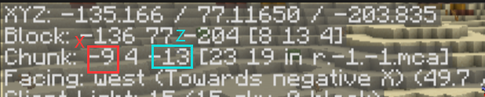

# PotatoPeeler

  

Lang: [English](README.md) | 简体中文

这是一个简单的小工具，用于移除 Minecraft **Java 版**存档中的无用区块，以腾出部分硬盘空间。  

* 可以看作是 Java 语言实现的 [Thanos](https://github.com/aternosorg/thanos)。   

* 仅支持 [Anvil](https://minecraft.wiki/w/Anvil_file_format) 文件格式（自 Minecraft JE 1.2.1 起）。

* 较好的情况下可以把游戏存档的硬盘占用减少**超过 50%**。  

* 支持用区块坐标、区块坐标范围（支持通配符）配置每个世界的**受保护区块**，阻止某些区块被移除。

## 1. 工作原理

区块存储在 [Anvil](https://minecraft.wiki/w/Anvil_file_format) 文件内，Minecraft Java 版会为每个区块存储一个字段 `InhabitedTime`，以记录玩家在这个区块内停留的累计时间刻（tick）数。  

本工具通过 `InhabitedTime` 值筛选出玩家几乎没有停留的的区块，以进行移除。其既可以在本地游戏存档上使用，也可以在服务器存档上使用。  

> 玩家只要在某个区块的 生物生成距离<sup>[详见文档](https://minecraft.wiki/w/Spawn#Spawn_cycle)</sup> 内，这个区块的 `InhabitedTime` 就会增长。即玩家所在区块的周围区块的 `InhabitedTime` 往往也会增长。  

## 2. 使用前一定要注意

1. 如果你采用的是 Paper 端，或者是以 Paper 为上游的服务端（比如 Purpur），请**不要**在 Paper 的世界配置文件中把 `fixed-chunk-inhabited-time`<sup>[详见文档](https://docs.papermc.io/paper/reference/world-configuration#chunks_fixed_chunk_inhabited_time)</sup> 这一项设置为 $\ge 0$ 的值，否则区块的 `InhabitedTime` 会被固定，从而影响工具功能。

2. 如果你的存档是通过**模组 / 外部软件**编辑得到的，而不是人为建造的，其中的区块的 `InhabitedTime` 值难以预料，这种情况下不建议使用本工具。  

   > 当然，你也可以配置[受保护的区块](#5-受保护的区块)以防止某些区块被移除。

3. 本工具会对区域区块 Anvil 文件进行**原地处理**，发生的更改都是先写入一个临时文件再替换回去。尽管如此，还是建议时不时做一下备份。  

## 3. 安装

1. 你应该已经安装了相应版本的 JRE（Java 运行环境），可以参考[这个文档](https://zh.minecraft.wiki/w/%E6%9C%8D%E5%8A%A1%E5%99%A8/%E9%9C%80%E6%B1%82#%E6%9C%8D%E5%8A%A1%E5%99%A8%E9%9C%80%E6%B1%82)。  
2. 从 [Releases](https://github.com/Bottle-M/PotatoPeeler/releases/latest) 按照你的 Java 版本下载 `PotatoPeeler*.jar`，找个位置放着即可（比如 Minecraft 服务端根目录）。  

## 4. 使用

你可以在命令行运行此工具程序：  

```bash
java [jvmOptions...] -jar PotatoPeeler*.jar 
    [--world-dirs <worldPath1>,<worldPath2>,...]
    [--server-jar <serverJarPath>]
    [--min-inhabited <ticks>]
    [--help]
    [--cool-down <minutes>]
    [--threads-num <number>]
    [--verbose]
    [--skip-peeler]
    [additionalOptions...]
```

| 标志项 | 说明 |
|---|---|
| `--help` | 显示帮助信息 |
| `--verbose` | 往日志中输出详细信息 |
| `--skip-peeler` | 直接跳过区块处理过程。若指定了 `--server-jar` 参数，会直接启动 Minecraft 服务端 |  


| 参数项 | 默认值 | 说明 |
|---|---|---|
| `--world-dirs` |  | 用逗号分隔的世界存档**路径**。<br><br> * 比如 `/opt/server/world,world_nether`，指定了两个世界目录，分别以绝对路径和相对路径的方式。程序会逐个处理这些世界。|
| `--min-inhabited` | `0` | 区块的 `InhabitedTime` 阈值（单位为 **tick**，20 ticks = 1 秒）。<br><br> * 某个区块的 `InhabitedTime` **低于或等于**这个值时，若其**未受保护**<sup>[见下方](#5-受保护的区块)</sup>，则**会被移除**。<br>* 比如我想移除玩家总停留时间 $\le 5$ 秒的区块，就设定为 `100`。 |
| `--cool-down` | `0` | 距离上次区块处理**过去多久后**才能再次使用本工具（单位为**分钟**）。<br><br> * 注意是自上次所有指定世界的区块处理完成起计时。比如采用了 `--skip-peeler` 标志跳过了区块处理，就不计入在内。 |
| `--threads-num` | `10` | 采用多少线程并发（多核情况下可能能并行）处理一个世界中的 Anvil 文件。 |
| `--server-jar` |  | 指定 Minecraft 服务端 jar 包路径。<br><br> * 如果指定了可用的 jar 包，在本工具程序执行完后将会直接在当前 JVM 中运行此 jar 包，启动服务器。 |
| jvmOptions |  | JVM 参数。<br><br> * 如果指定了 `--server-jar`，JVM 参数会被服务端沿用。 |
| additionalOptions |  | 剩余参数。<br><br> * 如果指定了 `--server-jar`，这些参数会被传递给服务端。| 

* 注 1：对于原版存档格式，你可以这样指定各个世界维度： `--world-dirs world,world/DIM1,world/DIM-1`。  

  > 实际上本工具会采用广度优先方式搜索目录下的 `region` 子目录。  

* 注 2：如果不想在命令行写参数，你可以在 `PotatoPeeler*.jar` 的工作目录下建立一个文件 `potatopeeler.args`，把命令行参数全部写入此文件（JVM 参数除外）。   
  
  > 仅当命令行中**没有指定**参数时（JVM 参数除外），本工具才会读取 `potatopeeler.args` 文件。

## 5. 受保护的区块

受保护的区块**不会被移除**，主要包含以下三类：  

1. 世界中**强制加载**的区块（[/forceload](https://zh.minecraft.wiki/w/%E5%91%BD%E4%BB%A4/forceload)）。  
2. **自定义**的受保护区块。  
3. [数据量过大](https://zh.minecraft.wiki/w/%E5%8C%BA%E5%9F%9F%E6%96%87%E4%BB%B6%E6%A0%BC%E5%BC%8F#%E5%8C%BA%E5%9F%9F%E9%A2%9D%E5%A4%96%E6%96%87%E4%BB%B6)的区块。

### 5.1. 自定义受保护区块

你可以在世界[维度根目录](https://zh.minecraft.wiki/w/Java%E7%89%88%E5%AD%98%E6%A1%A3%E6%A0%BC%E5%BC%8F#%E5%AD%98%E6%A1%A3%E7%BB%93%E6%9E%84)（也就是和 `region` 在同一级目录中）下建立一个文本文件 `chunks.protected`，以指定要**在这个世界中**保护的区块。

<details>

<summary>点击查看这个文件所在位置的示例</summary> 

```bash
world
├── DIM-1
│   ├── data
│   │   └── raids_end.dat
│   └── region
│       └── ...
├── DIM1
│   ├── data
│   │   └── raids_end.dat
│   ├── region
│   └── chunks.protected # 末地维度中要保护的区块
├── data
│   └── raids.dat
├── datapacks
├── entities
│   ├── r.-1.-1.mca
│   └── ...
│   
├── level.dat
├── level.dat_old
├── chunks.protected # 主世界维度中要保护的区块
├── playerdata
├── region
│   ├── r.-1.-1.mca 
│   ├── r.-1.0.mca
│   ├── r.0.-1.mca
│   └── r.0.0.mca
└── session.lock
```

注：非原版服务端可能把 `DIM-1`, `DIM1` 这些维度单独存放在其他目录中，比较常见的则是 `world_nether/DIM-1`，`world_the_end/DIM1`。

</details>

### 5.2. chunks.protected 文件格式

1. 一行指定一条规则，可以是形如 `x,z` 的单个区块坐标点，也可以是 `x1~x2,z1~z2` 这样的矩形区域。  
2. 支持通配符 `*`。（比如 `*~5,6` 就可以保护 $x \in [-2^{31},5], z = 6$ 这个长条形状区域内的区块。）  
3. 支持以 `#` 开头的单行注释和行内注释。

> 以上提到的坐标均为**区块坐标**，在游戏中按下 F3 也可以看到：
>   

<details>

<summary>点击查看文件内容示例</summary>

```bash
# 保护所有区块，这样的话本工具根本就没法在这个世界维度发挥作用
*,*

*~*,* # 这样写也是一样的
*,*~*

# 保护 x 从 -5 到 5，z = 6 的长条形状区域
-5~5,6

# 保护 x 从 -54 到 14，z 从 7 到 77 的矩形区域
-54 ~ 14 ,  7    ~  77 # 写松散点也没事

# ~ 两边的数字谁大谁小无所谓
1~4, 18~9   # 保护 x 从 1 到 4，z 从 9 到 18 的矩形区域

# 仅保护单个区块
12 , 450
```

</details>

## 6. 日志

所有输出到控制台的日志都会保存在本工具运行目录的 `peeler_logs` 子目录中。  

## 7. 例子

### 7.1. 作为独立工具使用

```bash
# 从指定的三个世界中移除掉玩家总停留时间 <= 5 秒的区块
java -jar PotatoPeeler*.jar --min-inhabited 100 --world-dirs world,world_nether,/opt/server/world_the_end

# 或者可以更简单点，只指定世界路径。默认情况下只移除玩家总停留时间 = 0 秒的区块
java -jar PotatoPeeler*.jar --world-dirs world,world_nether,/opt/server/world_the_end
```

### 7.2. 作为服务端前置程序使用

```bash
# 从指定的两个世界中移除掉玩家总停留时间 <= 5 秒的区块
# 移除完成后会在当前 JVM 中启动 purpur.jar
# JVM 参数 -Xms1G -Xmx4G 会被沿用
# 其他参数 / 标志 --nogui --forceUpgrade 会被传递给 purpur.jar 
java -Xms1G -Xmx4G -jar PotatoPeeler*.jar --min-inhabited 100 --world-dirs world,world_nether --server-jar purpur.jar --nogui --forceUpgrade
```

### 7.3. 服务器重启时进行区块清理  

可以给服务器设置定时重启任务。比如我每天凌晨四点执行重启，但是我又想**每 4 天**清理一次无用区块，就可以这样写**服务器启动脚本**：  

```bash
#!/bin/bash
# 利用 --cool-down 参数配置每次清理完后冷却 5760 分钟才会进行下一次清理，即每 4 天清理一次无用区块
java -Xms1G -Xmx4G -jar PotatoPeeler*.jar --cool-down 5760 --world-dirs world,world_nether --server-jar purpur.jar --nogui
```

### 7.4. 清理本地存档的区块

```bash
java -jar PotatoPeeler*.jar --world-dirs 'C:\Users\Administrator\AppData\Roaming\.minecraft\saves\MyWorld'
```  

### 7.5. 判断受保护区块是否正常载入

  

对于每个世界维度，如果有 `chunks.protected` 配置文件，程序就会在控制台打印：  

```
Protected chunks from <path of chunks.protected> have been read.
```

> 如果 `chunks.protected` 格式错误无法读取，程序会提示错误的行号和部分内容。    

如果这个世界中包含被强制加载的区块，将会打印：  

```
Force-loaded chunks read.
```

### 7.6. 从文件中导入命令行参数

<details>

<summary>点击查看此示例</summary>

当没有指定命令行参数时，程序会尝试从 `potatopeeler.args` 文件中读取参数。

可以把命令行参数（不包括 JVM 参数）全部写入 `PotatoPeeler*.jar` 工作目录下的 `potatopeeler.args` 文件。  

`potatopeeler.args` 文件示例如下：  

```bash
--min-inhabited 100 --world-dirs world,world_nether,world_the_end --server-jar purpur.jar
```

通常把 `potatopeeler.args` 和 `PotatoPeeler*.jar` 两个文件放到同一目录下：  

```bash
Server Root
├── PotatoPeeler-1.0.0.jar # 本工具程序
├── bukkit.yml
├── config
├── plugins
├── potatopeeler.args # PotatoPeeler 参数文件
├── server.properties
├── spigot.yml
├── purpur.jar
├── whitelist.json
├── world
├── world_nether
└── world_the_end
```

然后直接执行 `java -jar PotatoPeeler*.jar` 即可，命令行参数会自动从 `potatopeeler.args` 文件中读取。

</details>

## 采用的开源项目

感谢开源开发者们的辛苦工作！

* [lz4-java](https://github.com/lz4/lz4-java)  
* [rtree2](https://github.com/davidmoten/rtree2)  

## 参考文档

1. [区域文件格式 - Minecraft Wiki](https://zh.minecraft.wiki/w/%E5%8C%BA%E5%9F%9F%E6%96%87%E4%BB%B6%E6%A0%BC%E5%BC%8F)  
2. [强制加载区块存储格式 - Minecraft Wiki](https://zh.minecraft.wiki/w/%E5%BC%BA%E5%88%B6%E5%8A%A0%E8%BD%BD%E5%8C%BA%E5%9D%97%E5%AD%98%E5%82%A8%E6%A0%BC%E5%BC%8F)  
3. [Java版存档格式 - Minecraft Wiki](https://zh.minecraft.wiki/w/Java%E7%89%88%E5%AD%98%E6%A1%A3%E6%A0%BC%E5%BC%8F)  
4. [区块存储格式 - Minecraft Wiki](https://zh.minecraft.wiki/w/%E5%8C%BA%E5%9D%97%E5%AD%98%E5%82%A8%E6%A0%BC%E5%BC%8F)  
5. [NBT 二进制格式 - Minecraft Wiki](https://zh.minecraft.wiki/w/NBT%E6%A0%BC%E5%BC%8F?variant=zh-cn#%E4%BA%8C%E8%BF%9B%E5%88%B6%E6%A0%BC%E5%BC%8F)  

## License

本项目使用 MIT 许可证，感谢你的使用 o(\*￣▽￣\*)o。  